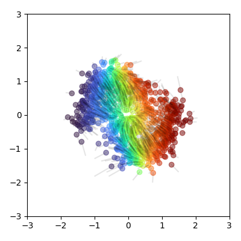

# Two-Dimensional Flows

This repository contains a lightweight framework for training and visualising normalizing flows
and flow-matching (diffusion) models in PyTorch in a simple 2D setting with a few toy datasets.

## Example Samples

|||||||
|-|-|-|-|-|-|
| Coupling Flow |    |    |    |    |    |
| Linear Continuous Flow|  |  |  |  |  |
| Variance Preserving Continuous Flow|  |  |  |  |  |


## Project Structure

- **src/models.py**
  Houses core model definitions, including the Flow and Diffuser classes, which handle
  normalizing-flow logic and diffusion-based mechanisms.

- **src/utils.py**
  Contains utility functions for various sampling and data-handling tasks.

- **src/mlp.py**
  Defines a simple fully connected neural network (MLP) used within the Diffuser class.

- **src/normflows.py**
  Provides coupling-based spline flow implementations.

- **src/distributions.py**
  Contains a few simple distribution classes for generating toy data.

## Installation

1. Clone the repository:
   ```
   git clone https://github.com/example/FlowTest.git
   ```
2. Inside the directory, install requirements:
   ```
   pip install -r requirements.txt
   ```

## Usage

The only executable python file is `train.py`, which trains and plots the morphing of a 2D space using a normalizing flow or diffusion model.

For the model_name argument there are three options:
- `flow`: For a normalizing flow model using coupling layers with rational-quadratic spline transformations
- `linear_uniform`: For a diffusion model with linear interpolation and uniform time sampling
- `linear_signorm`: For a diffusion model with linear interpolation and time sampling from a sigmoid-normal distribution
- `vp_uniform`: For a diffusion model with variance preserving interpolation and uniform time sampling
- `vp_signorm`: For a diffusion model with variance preserving interpolation and time sampling from a sigmoid-normal distribution

For the 2D synthetic datasets, there are three options:
 - `normal`: A 2D normal distribution
 - `uniform`: A 2D uniform distribution
 - `moons`: The classic two moons dataset from scikit-learn
 - `squares`: A 2D distribution with four squares
 - `deltas`: A 2D distribution with delta peaks at the corners of the unit square
All distributions are scaled such that the have zero mean and unit variance.

See the `run.sh` script for some examples.
